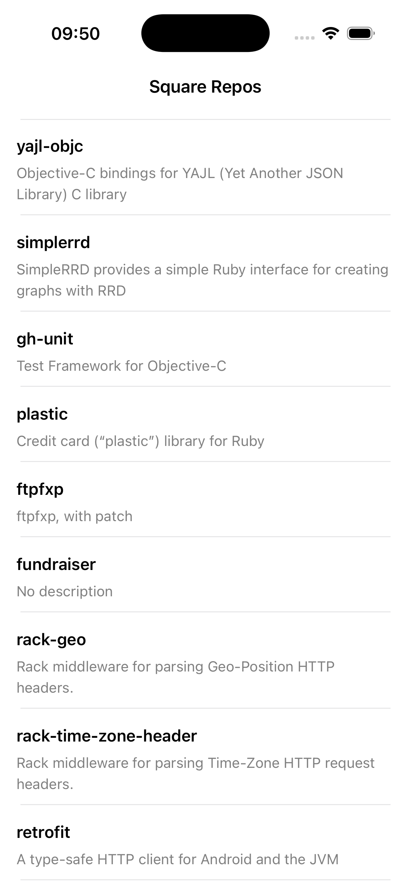
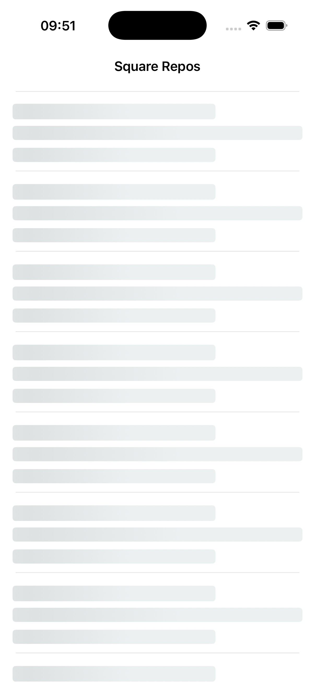
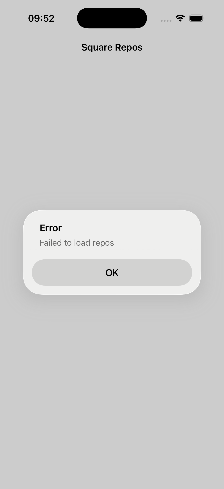

# SquareReposIOS
SquareRepos is an iOS application that fetches and displays the list of public repositories of the Square organization from GitHub.

In this project i used MVVM architerture: 
Model - Repository struct with name and description properties
View - ReposViewController and ReposTableViewCell which are responcible for displaying the UI.
ViewModel - ReposViewModel which manages states using State enum (idle, loading, loaded, error) and notifies the controller when the UI should be updated
GitHubService handles networking and returns data

The app uses a custom RepoTableViewCell which created programmatically with Snapkit package to display repository information(name and description). This allows flexible layout and styling instead of default table view cell.
While data is being fetched from GitHub, the app shows animated skeleton placeholders using SkeletonView from package, this impoves user experience by indicationg that content is loading instead of showing an empty screen.
If the data fails to load, the app displayes alert when data cannot be loaded.

The app includes unit tests for GitHubService, where the networking layer is replaced with a custom MockURLProtocol. This approach allows simulating different scenarios (successful response, network error, decoding failure) without making real API calls, ensuring reliable and isolated test coverage.

